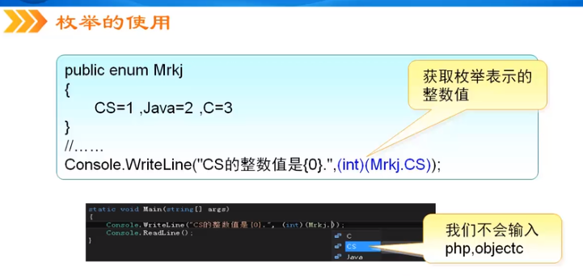

- [C#从入门到精通](#c从入门到精通)
  - [基础知识](#基础知识)
    - [C# 创建工程](#c-创建工程)
    - [命名空间](#命名空间)
    - [类](#类)
    - [Main](#main)
    - [代码规范](#代码规范)
    - [命名](#命名)
    - [变量](#变量)
    - [数据类型](#数据类型)
      - [枚举类型](#枚举类型)
      - [类型转换](#类型转换)
    - [3.4 常量](#34-常量)
    - [4.2 运算符](#42-运算符)
    - [运算符的优先级](#运算符的优先级)
  - [字符](#字符)

# C#从入门到精通

- 参考网址：https://www.bilibili.com/video/BV1EK4y1b7ux?p=5
- 使用 VS 开发

## 基础知识

### C# 创建工程

- DOS： 控制台应用程序
- C/S： Windows 窗体应用程序
- B/S： ASP.NET 网站

### 命名空间

- 创建命名空间：namespace 命名空间名称
- 引用命名空间：using 命名空间名
- 原来 C# 引用的是命名空间，不是头文件
  - 命名空间中创建类，引用后，才能调用类成员的

### 类

- 类是一种数据结构，存储数据成员，方法成员和其他类等内容，便于调用
- 一个命名空间可以定义多个类，但类名不能相同

### Main

- Main 必须是静态的 static
- Main 必须大写 M
- 命令行参数可选： string[] args  可以删除
- Main 方法的返回值可以是 void 或者 int
- 一个项目中可以有多个 Main 方法，但是只能有一个入口 Main，所以，需要指定用哪个 Main；
  - 设置方式：项目 -> 项目名属性 -> 启动对象； 选择需要的那个 Main

### 代码规范

- 尽量使用接口编程；关键语句一定写注释
- 局部变量随用随声明；尽量少用 goto 语句
- 如果参数多，建议使用结构；避免对大段代码使用 try...catch
- 同一个文件中避免编写多个类；字符串多变时，用 StringBuilder
- if 语句块中使用 {}；switch 语句中一定要编写 default

### 命名

- Pascal 命名法；用在 类，接口，方法
  - 方法命名用 动宾 规则命名
  - 接口前缀是 I
- Camel 命名法；用在 变量
  - 成员变量前缀 _

### 变量

- C# 里面可以用汉字作为变量名； int 数值 = 1； 是对的；但是不建议使用
- C# 里面在使用一个变量之前，必须对其赋值
  - 没有数值，则使用空 “”，null，0 等
- 在类体中定义的是 成员变量；在类中的所有地方都能使用，相当于全局变量
  - 静态变量：在类中定义的 static 变量； static int x = 90；
    - 静态变量可以使用类名调用
  - 实例变量：在类中定义普通变量； int x = 60；
    - 实例变量不可以使用类名调用，必须要实例化才能调用
- 在方法体中定义的是 局部变量；只在方法体中使用
  - 静态方法才能直接调用静态变量

### 数据类型

- 值类型：存储的数据值
  - 简单：整数，实数；字符；布尔
  - 复合：结构，枚举；
- 引用类型：存储的是对值的引用
  - 类，接口，数组，委托；
  - C# 中默认有两个引用类型；string 类 和 object 类

值类型（简单），存储在栈中，读写速度比较快

- 浮点类型
  - 可以强制指定：float f = 10.3f；float f = 10.3F；
  - 可以强制指定：double d = 10.3d；double d = 10.3D；
  - 如果一个小数默认没有指定数据类型，默认是 double 类型
  - 如果小数没有赋值，默认是 0 不是 0.0；
- decimal 类型；精度更高的浮点类型，有 28 位；
  - decimal money = 1.12m；decimal money = 1.12M
  - 常用于财务或货币计算
- bool 类型默认是 false；

引用类型；相当于指针，指向相同的地址

- student1.Name = "aa";  student2 = student1; student2.Name = "bb";
  - 这个时候 student1.Name 变成了 "bb" 因为它是引用类型，相当于指向相同的地址

C# 中所有类的基类都是 System.Object 等价于 object

- 所有创建的类，默认都是继承了 Object
  - Class Person    <== 等价于 ==>    Class Person : Object

C# 中的 System.String 等价于 string

- string 是为了简化字符串操作；在 C 语言中需要使用 ASCII 码和函数实现字符串操作
- 注意：string 是引用类型，理论上应该和 student 类一样，相当于指针；
  - 但是实际上 str1 = “aa”; str2 = str1; str2 = "bb";
  - str2 此时是修改了的
  - 在 C# 里面会重新生成一个 str2 的对象，相当于两个 str2 交给垃圾回收机制回收
  - 这种情况表面上好像改变了，但是本质是生成了新的对象

值类型和引用类型的区别

- 值类型：每创建一个值类型会把这个值和标号都放到栈里面
- 引用类型：标号放到栈里面，而值放到堆里面，标号指向堆里面的值


- 区别：
  - 值类型对一个变量修改，不会影响其他变量
  - 引用类型，一个变量修改，会影响到其他变量


#### 枚举类型

- 使用枚举类型可以增加程序的可读性和可维护性，避免类型的错误
- 如何避免错误：使用枚举会自动提示可选的数据，写错误的数据会报错
- 实际使用中，枚举类型用在定义用户的权限，不同的枚举，不同的权限
- 同时参考文档：.\C_Sharp_Note.md



#### 类型转换

隐式转换

- 注意：bool 类型不可以和数值类型运算
  - bool 的值是 true 或 false 不可以隐式转换为整型 1 0


显示转换（强制类型转换），有三种形式

- 1、使用 () 包含数据类型
  - 比如：int b = （int）10.2;
  - 注意：强制类型转换的溢出错误
    - int i = (int)((long)30000000000000);
    - 这个时候 i 是一个负数，因为 int 是有符号数，32 位全部为 1，数据溢出
- 2、使用 Convert 类：它是把一个基本数据类型转换为另一个基本数据类型；可以查看 VS 中的帮助文档；
  - double a = 10.5; int c = Convert.ToInt32(a);
- 3、使用 Parse 类，这种方法只适合数值类型转换；不是数值类型是没有这个方法的
- 最常用的是第二种 Convert 方法


值类型和引用类型的转换

- 因为值类型在栈中，引用类型在堆中，转换过程称为装箱和拆箱
- 装箱：把值类型转换为引用类型，装箱不需要强制转换；
- 拆箱：把引用类型转换为值类型，需要强制转换；
- 注意：拆箱过程必须保证数据类型一致
  - long l = 10； Object obj = l; int i = (int)obj; 是错的，拆箱操作必须保证类型一致
- 装箱操作和拆箱操作会用后面的泛型替代使用，在实际开发中尽量避免使用装箱和拆箱


- 同时参考文档：.\C_Sharp_Note.md

### 3.4 常量

- 常量的分类：
  - 编译时常量 const； const double PI = 3.1415926
  - 运行时常量 readonly； readonly int Price = 10.2;
- const 和 readonly 的区别
  - const 必须在定义的时候初始化，不初始化会报错
  - readonly 可以在定义的时候初始化，也可以只声明，在构造函数里面对它初始化；在别的地方初始化会报错


- 理解 编译时常量 和 运行时常量
  - 编译时常量：即在编译的时候就已经有值了，赋值可以使用
  - 运行时常量：在编辑的时候是 0，运行的时候才有值；赋值的时候是 0

```
const int PRICE1 = PRICE2 + 2;
const int PRICE2 = 10;
static readonly int PRICE3 = PRICE4 + 2;
static readonly int PRICE4 = 11;
// 输出：12，10，2，11；
const int PRICE1 = PRICE2 + 2;
const int PRICE2 = 10;
static readonly int PRICE4 = 11;
static readonly int PRICE3 = PRICE4 + 2;
// 输出：12，10，13，11；
```

### 4.2 运算符

算数运算符

- 注意：% 取余运算符的符号与左操作数相同
  - i = -6.5 % -2；应该等于 -0.5
  - i = 6.5 % -2；应该等于 0.5

赋值运算符

- 注意：复合赋值运算符的优势；可以自动完成类型转换
  - byte a =1； a = a + 2; 错，因为 2 默认是 int 型，不能直接赋值给 byte 变量
  - a += 2； 对；复合赋值运算符可以自动完成类型转换

关系运算符

- 注意：不能串接使用关系运算符
  - a < b < c; 错的；< 号是单目运算符；
  - 这个表达式会先计算 a < b 得到 true 或 falsh 再计算 true < c；
  - 这个表达式是错误的，bool 不能与数值运算，也不能和数值比较
  - ((a < b) && (b < c))

逻辑运算符

- C# 中 && 和 & 都是与；|| 和 | 都是逻辑或；!true = flase; !flase = true;
- && 和 & 的区别
  - && 是短路与，第一个条件为 false 则不会判断第二个条件
  - & 会判断两个条件，即使第一个条件是 false；
  - || 和 | 也是相同的道理；

位运算符

- 位与：&
- 位或：|
- 位取反：~
- 位异或：^
- 位运算通常在程序中用在对简单的密码进行加密
- 左移位运算符：<<
  - 往左边移动一位，最低位补 0
- 右移位运算符：>>
  - 往右边移动一位，最高位如果是 0 则补 0；如果是 1 则补 1
  - 正数：48 右移一位是 24 （00110000 -> 00011000）
  - 负数：-80 右移两位是 -20 (10110000 -> 11101100) 负数是补码存储

其他运算符

- 1、条件运算符：判断公式 ？ 结果1 : 结果2;  (10>20 ? true : flase)
  - 条件运算符具有右结合性；即先运行右边的表达式
  - (10>20 ? true : a>b?a:b) 先执行 a>b?a:b 在执行外层公式
  - 条件表达式不能作为一条单独的语句放到程序中，必须赋值给一个变量或做下一步操作
- 2、逗号表达式：,
- 3、is 运算符；对象 is 类型；返回 true 或 false
  - int i = 1；bool result = i is object;

### 运算符的优先级

- 使用 () 提高公式的可阅读性；


## 字符

- 字符 Char/char 只能表示一个字符，用单引号括起来；
- Char 本身也是一个类，自身带有很多的方法可以直接使用；
  - Char

