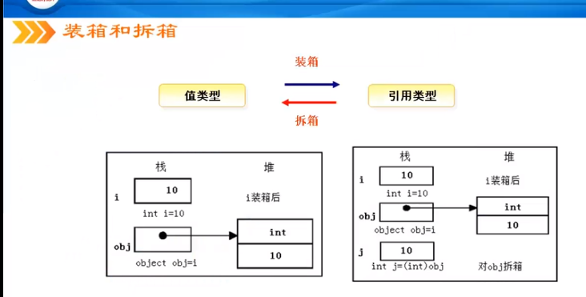
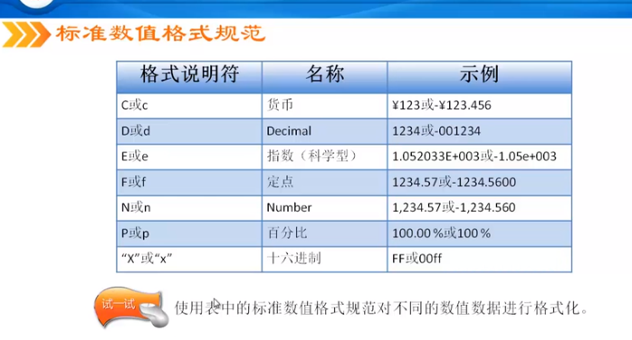
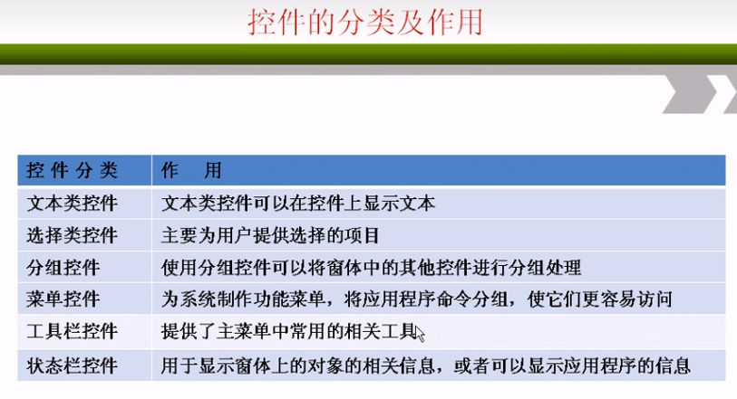
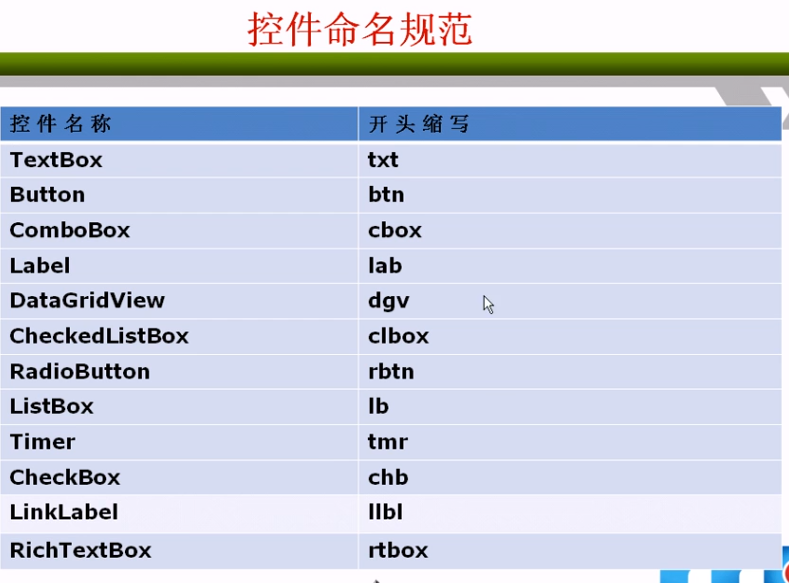

- [C#从入门到精通](#c从入门到精通)
  - [基础知识](#基础知识)
    - [C# 创建工程](#c-创建工程)
    - [命名空间](#命名空间)
    - [类](#类)
    - [Main](#main)
    - [代码规范](#代码规范)
    - [命名](#命名)
    - [变量](#变量)
    - [数据类型](#数据类型)
      - [枚举类型](#枚举类型)
      - [类型转换](#类型转换)
    - [3.4 常量](#34-常量)
    - [4.2 运算符](#42-运算符)
    - [运算符的优先级](#运算符的优先级)
  - [字符串](#字符串)
    - [字符](#字符)
    - [字符串](#字符串-1)
      - [字符串拼接](#字符串拼接)
      - [字符串比较](#字符串比较)
      - [字符串格式化](#字符串格式化)
      - [字符串截取](#字符串截取)
      - [字符串分割](#字符串分割)
      - [字符串插入](#字符串插入)
      - [字符串删除](#字符串删除)
      - [字符串复制](#字符串复制)
      - [字符串替换](#字符串替换)
      - [可变字符串类](#可变字符串类)
  - [第六章 语句](#第六章-语句)
    - [if 语句](#if-语句)
    - [switch 多分支语句](#switch-多分支语句)
    - [while 循环结构](#while-循环结构)
    - [do While 循环使用](#do-while-循环使用)
    - [for 循环语句](#for-循环语句)
    - [foreach 遍历数组](#foreach-遍历数组)
    - [转移语句（跳转语句）](#转移语句跳转语句)
  - [第七章 数组](#第七章-数组)
    - [二维数组](#二维数组)
    - [foreach 循环输出语句](#foreach-循环输出语句)
    - [冒泡排序，参考前面文档和程序](#冒泡排序参考前面文档和程序)
    - [选择排序算法](#选择排序算法)
    - [ArrayList 类；动态数组；使用大小会根据需要动态增加的数组](#arraylist-类动态数组使用大小会根据需要动态增加的数组)
    - [Hashtable 类；表示根据键的哈希代码进行组织的键/值对的集合](#hashtable-类表示根据键的哈希代码进行组织的键值对的集合)
  - [第八章 属性和方法](#第八章-属性和方法)
  - [第九章](#第九章)
  - [第十章 Form 窗体](#第十章-form-窗体)
    - [MDI 窗体](#mdi-窗体)
    - [继承窗体](#继承窗体)
  - [控件](#控件)
    - [控件的分类和作用](#控件的分类和作用)
    - [控件的相关操作](#控件的相关操作)
    - [文本类控件](#文本类控件)
    - [选择类控件](#选择类控件)
    - [分组类控件](#分组类控件)
    - [菜单、工具栏、状态栏控件](#菜单工具栏状态栏控件)
  - [第十二课 控件2](#第十二课-控件2)
    - [ImageList 控件](#imagelist-控件)

# C#从入门到精通

- 参考网址：https://www.bilibili.com/video/BV1EK4y1b7ux?p=5
- 使用 VS 开发

## 基础知识

### C# 创建工程

- DOS： 控制台应用程序
- C/S： Windows 窗体应用程序
- B/S： ASP.NET 网站

### 命名空间

- 创建命名空间：namespace 命名空间名称
- 引用命名空间：using 命名空间名
- 原来 C# 引用的是命名空间，不是头文件
  - 命名空间中创建类，引用后，才能调用类成员的

### 类

- 类是一种数据结构，存储数据成员，方法成员和其他类等内容，便于调用
- 一个命名空间可以定义多个类，但类名不能相同

### Main

- Main 必须是静态的 static
- Main 必须大写 M
- 命令行参数可选： string[] args  可以删除
- Main 方法的返回值可以是 void 或者 int
- 一个项目中可以有多个 Main 方法，但是只能有一个入口 Main，所以，需要指定用哪个 Main；
  - 设置方式：项目 -> 项目名属性 -> 启动对象； 选择需要的那个 Main

### 代码规范

- 尽量使用接口编程；关键语句一定写注释
- 局部变量随用随声明；尽量少用 goto 语句
- 如果参数多，建议使用结构；避免对大段代码使用 try...catch
- 同一个文件中避免编写多个类；字符串多变时，用 StringBuilder
- if 语句块中使用 {}；switch 语句中一定要编写 default

### 命名

- Pascal 命名法；用在 类，接口，方法
  - 方法命名用 动宾 规则命名
  - 接口前缀是 I
- Camel 命名法；用在 变量
  - 成员变量前缀 _

### 变量

- C# 里面可以用汉字作为变量名； int 数值 = 1； 是对的；但是不建议使用
- C# 里面在使用一个变量之前，必须对其赋值
  - 没有数值，则使用空 “”，null，0 等
- 在类体中定义的是 成员变量；在类中的所有地方都能使用，相当于全局变量
  - 静态变量：在类中定义的 static 变量； static int x = 90；
    - 静态变量可以使用类名调用
  - 实例变量：在类中定义普通变量； int x = 60；
    - 实例变量不可以使用类名调用，必须要实例化才能调用
- 在方法体中定义的是 局部变量；只在方法体中使用
  - 静态方法才能直接调用静态变量

### 数据类型

- 值类型：存储的数据值
  - 简单：整数，实数；字符；布尔
  - 复合：结构，枚举；
- 引用类型：存储的是对值的引用
  - 类，接口，数组，委托；
  - C# 中默认有两个引用类型；string 类 和 object 类

值类型（简单），存储在栈中，读写速度比较快

- 浮点类型
  - 可以强制指定：float f = 10.3f；float f = 10.3F；
  - 可以强制指定：double d = 10.3d；double d = 10.3D；
  - 如果一个小数默认没有指定数据类型，默认是 double 类型
  - 如果小数没有赋值，默认是 0 不是 0.0；
- decimal 类型；精度更高的浮点类型，有 28 位；
  - decimal money = 1.12m；decimal money = 1.12M
  - 常用于财务或货币计算
- bool 类型默认是 false；

引用类型；相当于指针，指向相同的地址

- student1.Name = "aa";  student2 = student1; student2.Name = "bb";
  - 这个时候 student1.Name 变成了 "bb" 因为它是引用类型，相当于指向相同的地址

C# 中所有类的基类都是 System.Object 等价于 object

- 所有创建的类，默认都是继承了 Object
  - Class Person    <== 等价于 ==>    Class Person : Object

C# 中的 System.String 等价于 string

- string 是为了简化字符串操作；在 C 语言中需要使用 ASCII 码和函数实现字符串操作
- 注意：string 是引用类型，理论上应该和 student 类一样，相当于指针；
  - 但是实际上 str1 = “aa”; str2 = str1; str2 = "bb";
  - str2 此时是修改了的
  - 在 C# 里面会重新生成一个 str2 的对象，相当于两个 str2 交给垃圾回收机制回收
  - 这种情况表面上好像改变了，但是本质是生成了新的对象

值类型和引用类型的区别

- 值类型：每创建一个值类型会把这个值和标号都放到栈里面
- 引用类型：标号放到栈里面，而值放到堆里面，标号指向堆里面的值


- 区别：
  - 值类型对一个变量修改，不会影响其他变量
  - 引用类型，一个变量修改，会影响到其他变量


#### 枚举类型

- 使用枚举类型可以增加程序的可读性和可维护性，避免类型的错误
- 如何避免错误：使用枚举会自动提示可选的数据，写错误的数据会报错
- 实际使用中，枚举类型用在定义用户的权限，不同的枚举，不同的权限
- 同时参考文档：.\C_Sharp_Note.md


#### 类型转换

隐式转换

- 注意：bool 类型不可以和数值类型运算
  - bool 的值是 true 或 false 不可以隐式转换为整型 1 0


显示转换（强制类型转换），有三种形式

- 1、使用 () 包含数据类型
  - 比如：int b = （int）10.2;
  - 注意：强制类型转换的溢出错误
    - int i = (int)((long)30000000000000);
    - 这个时候 i 是一个负数，因为 int 是有符号数，32 位全部为 1，数据溢出
- 2、使用 Convert 类：它是把一个基本数据类型转换为另一个基本数据类型；可以查看 VS 中的帮助文档；
  - double a = 10.5; int c = Convert.ToInt32(a);
- 3、使用 Parse 类，这种方法只适合数值类型转换；不是数值类型是没有这个方法的
- 最常用的是第二种 Convert 方法


值类型和引用类型的转换

- 因为值类型在栈中，引用类型在堆中，转换过程称为装箱和拆箱
- 装箱：把值类型转换为引用类型，装箱不需要强制转换；
- 拆箱：把引用类型转换为值类型，需要强制转换；
- 注意：拆箱过程必须保证数据类型一致
  - long l = 10； Object obj = l; int i = (int)obj; 是错的，拆箱操作必须保证类型一致
- 装箱操作和拆箱操作会用后面的泛型替代使用，在实际开发中尽量避免使用装箱和拆箱



- 同时参考文档：.\C_Sharp_Note.md

### 3.4 常量

- 常量的分类：
  - 编译时常量 const； const double PI = 3.1415926
  - 运行时常量 readonly； readonly int Price = 10.2;
- const 和 readonly 的区别
  - const 必须在定义的时候初始化，不初始化会报错
  - readonly 可以在定义的时候初始化，也可以只声明，在构造函数里面对它初始化；在别的地方初始化会报错


- 理解 编译时常量 和 运行时常量
  - 编译时常量：即在编译的时候就已经有值了，赋值可以使用
  - 运行时常量：在编辑的时候是 0，运行的时候才有值；赋值的时候是 0

```
const int PRICE1 = PRICE2 + 2;
const int PRICE2 = 10;
static readonly int PRICE3 = PRICE4 + 2;
static readonly int PRICE4 = 11;
// 输出：12，10，2，11；
const int PRICE1 = PRICE2 + 2;
const int PRICE2 = 10;
static readonly int PRICE4 = 11;
static readonly int PRICE3 = PRICE4 + 2;
// 输出：12，10，13，11；
```

### 4.2 运算符

算数运算符

- 注意：% 取余运算符的符号与左操作数相同
  - i = -6.5 % -2；应该等于 -0.5
  - i = 6.5 % -2；应该等于 0.5

赋值运算符

- 注意：复合赋值运算符的优势；可以自动完成类型转换
  - byte a =1； a = a + 2; 错，因为 2 默认是 int 型，不能直接赋值给 byte 变量
  - a += 2； 对；复合赋值运算符可以自动完成类型转换

关系运算符

- 注意：不能串接使用关系运算符
  - a < b < c; 错的；< 号是单目运算符；
  - 这个表达式会先计算 a < b 得到 true 或 falsh 再计算 true < c；
  - 这个表达式是错误的，bool 不能与数值运算，也不能和数值比较
  - ((a < b) && (b < c))

逻辑运算符

- C# 中 && 和 & 都是与；|| 和 | 都是逻辑或；!true = flase; !flase = true;
- && 和 & 的区别
  - && 是短路与，第一个条件为 false 则不会判断第二个条件
  - & 会判断两个条件，即使第一个条件是 false；
  - || 和 | 也是相同的道理；

位运算符

- 位与：&
- 位或：|
- 位取反：~
- 位异或：^
- 位运算通常在程序中用在对简单的密码进行加密
- 左移位运算符：<<
  - 往左边移动一位，最低位补 0
- 右移位运算符：>>
  - 往右边移动一位，最高位如果是 0 则补 0；如果是 1 则补 1
  - 正数：48 右移一位是 24 （00110000 -> 00011000）
  - 负数：-80 右移两位是 -20 (10110000 -> 11101100) 负数是补码存储

其他运算符

- 1、条件运算符：判断公式 ？ 结果1 : 结果2;  (10>20 ? true : flase)
  - 条件运算符具有右结合性；即先运行右边的表达式
  - (10>20 ? true : a>b?a:b) 先执行 a>b?a:b 在执行外层公式
  - 条件表达式不能作为一条单独的语句放到程序中，必须赋值给一个变量或做下一步操作
- 2、逗号表达式：,
- 3、is 运算符；对象 is 类型；返回 true 或 false
  - int i = 1；bool result = i is object;

### 运算符的优先级

- 使用 () 提高公式的可阅读性；


## 字符串

### 字符

- 字符 Char/char 只能表示一个字符，用单引号括起来；
- Char 本身也是一个类，自身带有很多的方法可以直接使用；
  - Char.ToString('b'); Char.IsUpper(ch); Char.IsLower(ch);
  - 参考 VS 中自带的帮助文档
- 转义字符：" \ "
  - WriteLine("C:\Windows"); 会报错，因为有无法转义的字符 "\W"
  - 用 @ 快速转义；WriteLine(@"C:\Windows\Microsoft.NET\v4.0");


### 字符串

- 字符串定义了，必须赋值后才能使用，直接使用会报错
- string 实际上是字符数组 char[] value= {'s','e','t'};
- 空字符串 str = “”；和空引用 str = null；
  - 空字符串，它有内存空间，可以调用 string 的任何方法
  - 空引用，没有指向任何引用地址，调用 string 的方法会有错

#### 字符串拼接

- 使用 +
  - string str = "123" + "456"; // 123456
- 使用 +=
  - string str = "123"； str += "456"; // 123456

#### 字符串比较

- 使用 ==
- 使用 String.Compare(s1, s2); 全字符比较
  - 返回 0：s1 等于 s2
  - 返回 1：s1 大于 s2
  - 返回 -1：s1 小于 s2
  - String.Compare(s1, s2, true); 不比较大小写
  - String.Compare(s1, s2, false); 比较大小写
- str.CompareTo(str1); 返回整型
- Equals；返回 bool 类型 （推荐使用）
  - str.Equals(str1); 实例化方法
  - string.Equals(str,str1); 使用 string 静态方法

#### 字符串格式化

使用 string.Format 格式化

- 数值格式化
  - String.Format();
    - string myStr = string.Format("{0} 小于 {1}"，a, b);



- 标准日期时间格式规范


使用 ToString 格式化

- int i = 10; i.ToString("C");
- strData.ToString("D");


- 参考代码：ConsoleApp1\Program.cs (字符串格式日期时间)

#### 字符串截取

使用 Substring 截取

- 字符串截取在程序中，常用来获取文件名，和扩展名


- 参考代码：ConsoleApp1\Program.cs (字符串截取)

#### 字符串分割

使用 Split 分割

- 把一串字符串，按照指定符号，分割成数组；比如，一串姓名，分开获取每个名字
- 参考 VS 帮助文档，string 类 -> split 方法
- 参考代码：ConsoleApp1\Program.cs (字符串分割)

#### 字符串插入

使用 string.Insert 在指定位置插入指定字符

- 参考代码：ConsoleApp1\Program.cs (字符串插入)

#### 字符串删除

使用 string.Remove 在指定位置删除指定数量的字符

- 参考代码：ConsoleApp1\Program.cs (字符串删除)

#### 字符串复制

使用 String.Copy 复制，全部复制
使用 String.CopyTo 复制，可以指定长度，位置

- 参考代码：ConsoleApp1\Program.cs (字符串复制)

#### 字符串替换

使用 Replace 替换

- 替换一个字符：str.Replace('a','b');
- 替换子字符：str.Replace("abc","cde");
- 参考代码：ConsoleApp1\Program.cs (字符串替换)

#### 可变字符串类

- 在 C# 中字符串是固定不变的，对字符串的操作，在内存中会重新创建一个新的字符


为了避免因为频繁的操作字符串，导致内存消耗，可以创建可变字符串

- StringBuilder 是在 System.Text 这个命名空间中；
  - 如果要使用 StringBuilder 应该注意是否包含了 System.Text 命名空间
- String 是在 System 命名空间中
- 使用 StringBuilder 对象的操作，始终都是对原字符串的操作，不会创建新的字符串


String 和 StringBuilder 的区别

- String 是不可变的，对 String 变量的操作，最后都会在内存中创建很多临时对象，影响性能
- StringBuilder 是可变的，操作的始终是一个对象，而且，速度更快
  - StringBuilder 就是为可变字符串操作而产生的
- 当程序中，频繁对某个字符串进行操作，使用 StringBuilder；避免产生太多临时对象
- 当程序中，只是对某个字符串简单的比较操作时，使用 String；

## 第六章 语句

### if 语句

- 注意：bool 值的判断不需要使用 ==
  - bool flag； if（flag == true）； 这种写法没有错，但是不好
  - bool 本来就是只有 true 和 false； 直接写 if（flag）；
  - 同理：if（!flag）;
- 只有一条if else 语句时，可以使用条件运算符，更加简洁；（条件 ？结果1 ：结果2）

### switch 多分支语句

- Switch 判断的数据类型必须是 bool，char，string，整型，枚举类型
  - 不能是 double，float 类型；
- 在 C# 中，每个 case 中必须有 break；在 C 语言中可以没有 break；
- switch 和 if... else if... else 的区别
  - switch 判断的是常量，效率更高；
  - if 判断的是条件语句

### while 循环结构

- 注意：在 C# 中 while(1) 和 while(0) 是错误的；应该写 while(true)
  - while 的表达式只能是 bool 值，不能是整型；
  - 在 C 语言中是正确的

### do While 循环使用

- do while 至少执行一次循环体
- while 可以一次都不执行

### for 循环语句

- for 循环中的逗号；表达式1 和 表达式3 中可以使用逗号，写多个语句


- 如果 表达式2 中要判断多个条件应该用 && 逻辑运算符，不能是逗号；


### foreach 遍历数组


### 转移语句（跳转语句）

- 如果遇到死循环，可以使用跳转语句 goto 语句
- 转移语句还包括：break；continue；goto
  - 在 for，while 循环中，使用 break 来跳出循环
    - 和 if 语句，控制循环结束
  - 在 for，while 循环中，跳过本次循环 continue；
    - 判断偶数的和，就可以使用 continue；
  - break 和 continue 不能用在 if 语句中；
  - goto 语句：可以忽略当前程序逻辑，直接跳转到指定位置执行程序
    - 程序中应该减少使用，会使程序逻辑混乱；


## 第七章 数组

- 在 C# 中声明了一维数组的长度，就必须要赋值相应的数值
  - int[] arr = new int[5]{1,2,3};  在 C# 中会报错，在 C++ 中是可行的；
  - 声明数组：int[] arr;   int[] arr = new int[3];


### 二维数组

- 创建数组：int[,] a = new int[2][3];  // 后面的 2，3 指定行数和列数
  - 这种方法创建每行的列数都相同
- 创建不规则数组：int[][] a = new int[2][];  // 后面不能指定列数，只需要指定行数
  - a[0] = new int[2];  // 第一行有 2 列
  - a[1] = new int[3];  // 第二行有 3 列
  - 这种方法创建每行的列数可以不同
- 二维数组初始化；不初始化不能使用


### foreach 循环输出语句

- 参考文档：C_Sharp_Note.md
- 参考代码：HelloWorld\Program.cs (foreach)

Array 类；里面有对数组的操作

- 参考文档：C_Sharp_Note.md
- 参考代码：HelloWorld\Program.cs ( System.Array 数组基类方法 )

### 冒泡排序，参考前面文档和程序

### 选择排序算法

- 思想：从数组当中，选择一个最小（最大）的数，放到第一位；
  - 再从剩下的数组中，选择最小的放到第二位；依次循环选择；
- 参考代码：ConsoleApp1\Program.cs （选择排序）

### ArrayList 类；动态数组；使用大小会根据需要动态增加的数组

- 常用方法：构造函数 3 种
- 添加
  - add 在结尾添加元素
  - insert 在指定位置添加元素
- 删除
  - Clear 移除所有 ArrayList 元素
  - Remove 移除特定对象的第一个匹配项
  - RemoveAt 移除指定索引处的元素
  - RemoveRange 移除一定范围的元素；
- 查找
  - Contains 判断元素是否在 ArrayList 中
- 参考代码：ConsoleApp1\Program.cs （ArrayList）

### Hashtable 类；表示根据键的哈希代码进行组织的键/值对的集合

- 构造函数多种
- 常用方法；添加
  - add 添加元素；有两个属性 key 和 value
- 删除
  - Clear 移除所有元素
  - Remove 移除指定键的值
- 遍历
  - 可以使用 foreach
  - 需要注意，Hashtable 是一个 键/值对，因此需要 DictionaryEntry 表示键值对的集合
- 查找
  - Contains 查找键
  - ContainsValue 查找特定值

## 第八章 属性和方法

- 属性
  - 定义一个私有变量，要保证变量的正确性，又要保证变量可以被外部访问
  - 就需要定义该私有变量的属性
- 对敏感的字段，需要使用属性
- 属性的特点：
  - 封装字段，将类中的字段和属性绑定到一起
  - 避免非法数据的访问
  - 保证数据的完整性


- 方法
- params 参数数组
  - 当方法需要传递多个不确定的参数的时候，可以使用 Add(params int[] x) 可以改变参数个数
  - 参数必须是一维数组
  - 参考代码：ConsoleApp1\Program.cs （params 可变参数）
- ref（引用参数） 修饰参数，相当于传递指针
  - 使用之前需要初始化
  - 参考文档：C_Sharp_Note.md（ 引用参数和输出参数 ）
- out（输出参数） 修饰参数，相当于传递指针
  - 想在方法中使用 未初始化的变量 或 返回多个值
  - 参考文档：C_Sharp_Note.md（ 引用参数和输出参数 ）
- 方法的重载
  - 方法名称相同、参数列表不同。
    - 1、参数个数不同
    - 2、参数类型不同
  - 参考文档：C_Sharp_Note.md（ 方法重载 ）

## 第九章

- 结构（struct）
  - 结构和类相似；区别：结构是值类型；类是引用类型；
  - 结构体中的构造函数必须要有参数；类可以没有参数
  - 结构体中的变量不能初始化；类中可以初始化变量
    - 因为，结构体是值类型，所以不能赋值
  - 参考文档：C_Sharp_Note.md（ 结构体类型 ）

面向对象编程基础

- 面向对象是从面向过程的程序转化而来
- 面向对象把数据和对数据的操作看做是一个不可分割的整体，力求将现实问题简单化
- 对象 = （算法 + 数据结构）
  - 程序 = （对象 + 对象 + ...）
  - 静态部分是 属性
  - 动态部分是 行为（方法）
- 类：封装对象属性和行为的载体；
- 实例化：类抽象出来的对象，这个对象就是一个实例

面向对象程序设计语言的三大原则

- 封装：
  - 类将内部数据隐藏，为用户提供属性和行为的接口，
  - 用户通过使用接口使用这些类，而无须知道类内部是如何构成的
- 继承：
  - 父类，共有的特性
  - 子类（派生类），即包含父类的特性，又包含自己的不同的内容
- 多态：
  - 父类的对象应用子类的特性，就是多态
  - 将子类的对象统一看做父类的实例对象，这样实例化父类对象，就可以绘制任何子类的图形
  - C# 中用到多态的地方主要是：抽象类和接口

类：对现实生活中一类具有共同特征的事物的抽象

- 类的声明：
  - 参考文档：C_Sharp_Note.md（ 类的定义（class））
- 构造函数；
  - 参考文档：C_Sharp_Note.md（ 构造函数 ）
- 析构函数；
  - 垃圾回收，不需要手动编写
  - 参考文档：C_Sharp_Note.md（ 析构函数 ）
  - 参考代码：ConsoleApp1\Program.cs （ 构造函数 和 析构函数 ）

对象和类的关系

- 对象的创建及使用
  - 创建：Book b = new Book();
  - 使用：b.Name(); b.Print();
- this 关键字；隐形的表示这个类
- 类和对象的关系
  - 类是抽象出来的集合
  - 对象是类实例出来的个

## 第十章 Form 窗体

- 1、创建 form 窗体项目 Form1
- 2、添加一个新的窗体 Form2；删除一个窗体
- 3、修改程序默认运行的窗体
- 4、窗体的属性
  - 1）更换窗体图标（Icon）
  - 2）隐藏窗体的标题栏（FormBoardStyle）
    - 可以设置其他窗体标题栏的显示
  - 3）窗体的起始位置（StartPosition）
    - 四个属性：WindowsDefaultLocation 按照 Location 的位置启动
    - CenterScreen: 屏幕居中
    - CenterParent： 副窗口中居中
  - 4）修改窗体大小（Size）
  - 5）设置窗体背景（BackgroundImage）
- 窗体的显示和隐藏
  - 在一个窗体中通过按钮打开另一个窗体；调用 Show 方法显示窗体
    - Form2 frm2 = new Form2();  // 实例化 Form2
    - frm2.Show();  // 调用 Show 方法显示 Form2 窗体
  - 窗体的隐藏；调用 Hide 方法隐藏
    - this.Hide();
- 窗体的事件
  - Click（单击）事件：单击窗体，触发窗体的 Click 事件
    - MessageBox.Show("Hello！！");  // 产生一个消息对话框
  - Load（加载）事件：窗体产生时自动加载的事件，先执行的 Load 事件的方法
  - FormClosing（关闭）事件；窗体关闭时，触发的事件
- 参考项目：WinFormsApp1


### MDI 窗体

- MDI（Multiple-Document Interface）多文档界面
  - 用于显示多个文档，每个文档显示在各自的窗口中
- 设置 MDI 窗体
  - 父窗体：把窗体的属性 IsMdiContainer 设置为 True
  - 子窗体：需要在代码里面设置

```
// 在主窗体的 Form1_Load 方法中编写
Form2 frm2 = new Form2();
frm2.Show();
frm2.MdiParent = this;
```

- 排列 MDI 子窗体
  - 使用 MdiLayout 定义 MDI 子窗体布局
  - Cascade：所有 MDI 子窗体均层叠在 MDI 父窗体的工作区内
  - TileHorizontal：所有 MDI 子窗体均水平平铺在 MDI 父窗体的工作区内
  - TileVertical：所有 MDI 子窗体均垂直平铺在 MDI 父窗体的工作区内
- 参考项目：WinFormsApp_MDI

### 继承窗体

根据现有的窗体的结构，创建一个与其一模一样的窗体；方便对基窗体的重复使用；

- 窗体的基窗体，必须在本命名空间中已编译成可执行文件或是 DLL（动态链接库）

创建继承窗体的方法

- 1、通过编程的方式
  - Form2 : WinFormsApp2_InhertedForm.Form1
- 2、通过继承选择器创建继承窗体
  - 创建窗体的时候选择继承的窗体


Modifiers 属性：控制继承窗体的控件是否可以编辑

- 如果继承窗体后，发现继承的窗体控件不可编辑，就要修改基窗体控件的 Modifiers 属性为 public；

- 参考项目：WinFormsApp2_InhertedForm


## 控件

### 控件的分类和作用

控件的分类：

- 文本类控件：在控件上显示文本
- 选择类控件：为用户提供选择的项目
- 分组控件：可以将窗体中的其他控件进行分组处理
- 菜单控件：为系统制作功能菜单，将应用程序命令分组，使它们更容易访问
- 工具栏控件：
- 状态栏控件：



控件命名规范：



### 控件的相关操作

添加控件

- 1、在窗体上绘制控件
- 2、将控件拖拽到窗体上
- 3、编程的方法
  - 参考程序代码：

控件对齐

- 选中要对齐的控件，使用工具栏中的快捷方式对其

控件锁

- Locked 属性设置为 True

控件删除

- 右击 -- 删除
- 选中 -- Delete 键

参考项目： WinFormsApp_Controls

### 文本类控件

Label 标签控件：显示用户不能编辑的文本；描述信息，窗口说明等

- 创建 label 标签
  - 1、工具箱 -- 拖拽
  - 2、代码创建
- label 标签的隐藏和显示
  - 属性：Visible 是 True 或者 False

Button 按钮控件：用户单击执行操作；

- Button 即可以显示文本，也可以显示图像；
- 执行过程是先被按下，然后释放
- 接受按钮：设置窗体 Form1 的 AcceptButton 属性；
  - 即在当前窗口按下回车响应的按钮
- 取消按钮：设置窗体 Form1 的 CancelButton 属性；
  - 当按下 ESC 这个按键，响应的按钮

TextBox 文本框控件，用于获取用户的输入或者显示文本

- 创建只读文本
  - 设置属性 ReadOnly 为 True
- 密码文本
  - 设置属性 UseSystemPasswordChar 为 True；显示为星号 *
  - 自定义加密字符，设置属性 PasswordChar 为任意字符，#
- 设置多行文本
  - 设置属性 Multiline 为 True
- 突出显示某些文本； 使用代码；在 Form1_Load 里面添加
  - textBox1.SelectionStart = 5;  // 从第5个字节开始
  - textBox1.SelectionLength = 5;  // 选中5个字节
- TextBox 响应更改事件
  - 设置事件 TextChange 代码

RichTextBox 有格式文本控件；用于显示，输入，操作带有格式的文本

- 可以显示字体，颜色，链接，嵌入图片，撤销，查找等多功能
- 比如 QQ 的聊天窗体
- 设置 RichTextBox 的滚动条；在 Form1_Load 里面添加
  - richTextBox1.Multiline = true;
  - richTextBox1.ScrollBars = RichTextBoxScrollBars.Vertical;
- 设置 RichTextBox 的字体；
  - 参考代码
- 设置 RichTextBox 的超链接；
  - 如果文本是一个网址，点击，访问链接
  - 需要写一个 LinkClicked(); 调用一个进程，访问链接
  - 详情参考代码，代码有错误，还找不到解决办法
- 设置 RichTextBox 的段落；
  - richTextBox1.SelectionBullet = true; 每一行都有项目符号指示；

参考项目： WinFormsApp_TextControl

### 选择类控件

1、下拉组合框控件（ComboBox 控件）
2、复选框控件（CheckBox 控件）
3、单选按钮控件（RadioButton 控件）
4、数值选择控件（NumericUpDown 控件）
5、列表控件（ListBox 控件）

下拉组合框控件（ComboBox 控件）; 它显示一个选项列表，用户可从中选择一项。

- 属性 comboBox1.DropDownStyle 可以选择
  - DropDownList； 文本框不可编辑，下拉列表可以选择
  - DropDown； 文本框可编辑
  - Simple； 下拉列表以文本的形式显示
- 为下拉列表添加选项
  - comboBox1.Items.Add("选项一");
- 全选文本框的内容
  - comboBox1.SelectAll();
- 文本框内容改变事件
  - comboBox1_SelectedIndexChanged();

复选框控件（CheckBox控件）; 多选框，值是 True 或 False

- 事件：复选框的单击事件
  - checkBox1_CheckedChanged
- 属性：复选框的选择状态
  - 被选中：checkBox1.CheckState == CheckState.Checked
- 属性：复选框默认是勾选或是未勾选
  - 设置属性 Checked 为 True 或 False
- 事件：复选框状态改变事件
  - checkBox1_CheckStateChanged

单选按钮控件（RadioButton 控件）; 是两个或多个互斥选项组成的选项集；只能选中一个

- 单选按钮的值是 true/false
  - radioButton1.Checked = false;
- 事件：单选按钮的 Click 事件
  - radioButton1_Click
- 事件：单选按钮的 选择改变 事件
  - radioButton1_CheckedChanged

数值选择控件（NumericUpDown 控件）; 是一个显示和输入数值的控件, 该控件提供一对上下箭头，用户可以单击上下箭头选择数值，也可以直接输入。

- 属性 Maximum 属性，设置数值的最大值，
  - 如果输入的数值大于这个属性的值，则自动把数值改为设置的最大值。
- 属性 Minimum 属性，设置数值的最小值，
  - 如果输入的数值小于这个属性的值，则自动把数值改为设置的最小值。
- 获得 NumericUpDown 值
  - numericUpDown1.Value
- 事件：ValueChanged
  - numericUpDown1_ValueChanged
- 属性：设置小数点位数
  - DecimalPlaces

列表控件（ListBox控件）; 用于显示一个列表，用户可以从中选择一项或多项; 如果选项总数超出可以显示的项数，则控件会自动添加滚动条。

- listBox 添加内容
  - listBox1.Items.Add(textBox1.Text);
- listBox 删除内容
  - listBox1.Items.Remove(listBox1.SelectedItem);
- 属性 始终显示滚动条
  - ScrollAlwaysVisible  ->  True
- 属性 显示水平滚动条
  - HorizontalScrollbar  -> True
- 属性 可以多选 listBox 内容
  - SelectionMode： MultiExtended 可以用 ctrl、shift 键配合多选

参考项目： WinFormsApp_SelectControl

### 分组类控件

- 1、容器控件（Panel控件）
- 2、分组框控件（GroupBox控件）
- 3、选项卡控件（TabControl控件）

容器控件（Panel控件）用于为其他控件提供可识别的分组。容器控件（Panel控件）可以有滚动条。

- Panel 可以添加其他控件，直接拖动就可以了
- 属性：Panel.Visible，设置 Panel 显示
  - 同时里面的控件也会显示出来

分组框控件（GroupBox控件）主要为其他控件提供分组，按照控件的分组来细分窗体的功能。

- 其在所包含的控件集周围总是显示边框，并且可以显示标题，

选项卡控件（TabControl控件）可以添加多个选项卡，然后在选项卡上添加子控件。

- 这个控件里面有多个页，每个页可以添加不同的控件或图片等
- 设置 TabPage 的属性
  - tabPage2.Text = "选项卡2";
  - tabPage2.ImageIndex = 1;
- 在 TabPage 中添加控件
  - tabPage1.Controls.Add(btn1);

参考项目： WinFormsApp_GroupControl

### 菜单、工具栏、状态栏控件

- 菜单控件（MenuStrip）是程序的主菜单。
  - MenuStrip 控件支持多文档界面、菜单合并、工具提示和溢出。
  - 可以通过添加访问键、快捷键、选中标记、图像和分隔条，来增强菜单的可用性和可读性。
  - 属性：为菜单栏按钮添加快捷方式；
    - Text(&F)  即 快捷方式 Alt + F
- 工具栏控件（ToolStrip控件）可以创建自定义的外观和行为的工具栏及其他用户界面元素。
  - 这些元素支持溢出及运行时重新排序。
  - 属性：image 可以设置按键图片
  - 属性：ToolTipText 鼠标悬停在按键的提示信息
- 状态栏控件（StatusStrip控件）通常处于窗体的最底部，用于显示窗体上的对象的相关信息，或者可以显示应用程序的信息。
  - 可以显示 Label，DropDownButton，SplitButton，ProgressBar 等控件
  - 代码：状态栏的进度拦的滚动
    - this.toolStripProgressBar1.PerformStep();

参考项目： WinFormsApp_Menu_Tool_Status

## 第十二课 控件2

### ImageList 控件

图像列表（ImageList）：用于存储图像资源，便于管理图像

- 添加图像
  - Add(Image value) 方法
- 删除图像
  - RemoveAt(index)  移除 index 图像
  - Clear()  移除所有的图像

参考项目： WinFormsApp_ImageList

